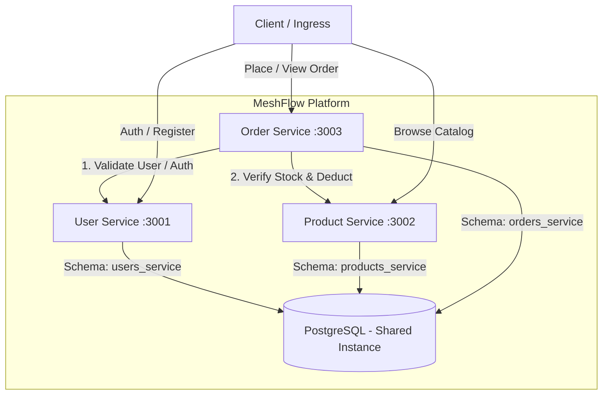

# MeshFlow — Microservices Platform

MeshFlow is a containerized microservices platform for a high-performance food ordering system. It features automated CI/CD, database isolation with PostgreSQL, and service-mesh readiness (Linkerd) for Kubernetes deployments.

```
meshflow/
├── user-service/         # User registration, JWT authentication & profile management (Port 3001)
├── product-service/      # Menu items catalog, pricing & inventory management (Port 3002)
├── order-service/        # Order orchestration with distributed user & stock checks (Port 3003)
├── .github/workflows/    # Service-isolated CI/CD workflows
├── k8s/                  # Kubernetes manifests (Namespace, Ingress, PostgreSQL)
├── docker-compose.yml    # Local multi-container development environment
└── README.md
```

---

## 🏗️ Architecture & Interaction Flow



---

## 📡 REST API Contracts

### 1. User Service (Port `3001`)
Base Path: `/users`

#### `POST /users/register`
Creates a new user account. Passwords are encrypted using bcrypt before storage.
- **Request Body:**
```json
{
  "name": "Alex Johnson",
  "email": "alex@example.com",
  "password": "Password123!"
}
```
- **Response `201 Created`:**
```json
{
  "message": "User registered successfully",
  "user": {
    "id": "1",
    "name": "Alex Johnson",
    "email": "alex@example.com",
    "createdAt": "2026-09-24T12:00:00.000Z"
  }
}
```
- **Error `400 Bad Request`:** Missing required fields or duplicate email.

---

#### `POST /users/login`
Authenticates user credentials and issues a signed JSON Web Token (JWT).
- **Request Body:**
```json
{
  "email": "alex@example.com",
  "password": "Password123!"
}
```
- **Response `200 OK`:**
```json
{
  "message": "Login successful",
  "token": "eyJhbGciOiJIUzI1NiIsInR5cCI6IkpXVCJ9...",
  "user": {
    "id": "1",
    "name": "Alex Johnson",
    "email": "alex@example.com"
  }
}
```
- **Error `401 Unauthorized`:** Invalid email or password.

---

#### `GET /users/:id`
Retrieves public profile for a user ID. Protected by Bearer token or inter-service auth.
- **Headers:** `Authorization: Bearer <token>`
- **Response `200 OK`:**
```json
{
  "id": "1",
  "name": "Alex Johnson",
  "email": "alex@example.com",
  "createdAt": "2026-09-24T12:00:00.000Z"
}
```
- **Error `404 Not Found`:** User does not exist.

---

### 2. Product Service (Port `3002`)
Base Path: `/products`

#### `GET /products`
Fetches all available menu products with current inventory.
- **Response `200 OK`:**
```json
[
  {
    "id": "1",
    "name": "Artisan Margherita Pizza",
    "description": "Wood-fired with San Marzano tomatoes and fresh mozzarella",
    "price": 14.99,
    "stock": 50,
    "createdAt": "2026-09-24T12:00:00.000Z"
  }
]
```

---

#### `POST /products`
Adds a new menu item to the catalog.
- **Request Body:**
```json
{
  "name": "Truffle Burger",
  "description": "Prime Angus beef with black truffle aioli",
  "price": 18.50,
  "stock": 30
}
```
- **Response `201 Created`:**
```json
{
  "id": "2",
  "name": "Truffle Burger",
  "description": "Prime Angus beef with black truffle aioli",
  "price": 18.50,
  "stock": 30,
  "createdAt": "2026-09-24T12:00:00.000Z"
}
```

---

#### `GET /products/:id`
Fetches a single product by ID.
- **Response `200 OK`:**
```json
{
  "id": "2",
  "name": "Truffle Burger",
  "description": "Prime Angus beef with black truffle aioli",
  "price": 18.50,
  "stock": 30,
  "createdAt": "2026-09-24T12:00:00.000Z"
}
```
- **Error `404 Not Found`:** Product not found.

---

#### `PATCH /products/:id/stock`
Adjusts or decrements stock level (used during order placement).
- **Request Body:**
```json
{
  "quantityChange": -2
}
```
- **Response `200 OK`:**
```json
{
  "id": "2",
  "name": "Truffle Burger",
  "stock": 28,
  "updatedAt": "2026-09-24T12:00:00.000Z"
}
```
- **Error `400 Bad Request`:** Insufficient stock.

---

### 3. Order Service (Port `3003`)
Base Path: `/orders`

#### `POST /orders`
Creates a food order. Steps performed internally:
1. Validates user existence with **User Service** (`GET /users/:userId`).
2. Checks stock and reserves items with **Product Service** (`GET /products/:id` and `PATCH /products/:id/stock`).
3. Computes order total and persists the order record in PostgreSQL.

- **Headers:** `Authorization: Bearer <token>` (optional for inter-service, validated if supplied)
- **Request Body:**
```json
{
  "userId": "1",
  "items": [
    { "productId": "1", "quantity": 2 },
    { "productId": "2", "quantity": 1 }
  ]
}
```
- **Response `201 Created`:**
```json
{
  "id": "1",
  "userId": "1",
  "totalAmount": 48.48,
  "status": "CONFIRMED",
  "items": [
    {
      "productId": "1",
      "productName": "Artisan Margherita Pizza",
      "unitPrice": 14.99,
      "quantity": 2,
      "subtotal": 29.98
    },
    {
      "productId": "2",
      "productName": "Truffle Burger",
      "unitPrice": 18.50,
      "quantity": 1,
      "subtotal": 18.50
    }
  ],
  "createdAt": "2026-09-24T12:00:00.000Z"
}
```
- **Error `400 Bad Request`:** Out of stock or invalid items.
- **Error `404 Not Found`:** User or Product does not exist.

---

#### `GET /orders/:id`
Retrieves an order by ID along with itemized details.
- **Response `200 OK`:**
```json
{
  "id": "1",
  "userId": "1",
  "totalAmount": 48.48,
  "status": "CONFIRMED",
  "items": [
    {
      "productId": "1",
      "productName": "Artisan Margherita Pizza",
      "unitPrice": 14.99,
      "quantity": 2,
      "subtotal": 29.98
    }
  ],
  "createdAt": "2026-09-24T12:00:00.000Z"
}
```

---

## 🗄️ Database Architecture (Single DB, Isolated Schemas)

PostgreSQL Database: `meshflow`
- **Schema `users_service`**:
  - `users` (id, name, email, password_hash, created_at, updated_at)
- **Schema `products_service`**:
  - `products` (id, name, description, price, stock, created_at, updated_at)
- **Schema `orders_service`**:
  - `orders` (id, user_id, total_amount, status, created_at, updated_at)
  - `order_items` (id, order_id, product_id, product_name, unit_price, quantity, subtotal)

---

## 🐳 Containerization Architecture (Phase 2)

Each microservice leverages an optimized, multi-stage Alpine Dockerfile:
- **Dependencies Stage**: Runs `npm ci --only=production` against package lockfiles to build a clean layer cache.
- **Production Stage**: Runs on a stripped-down `node:18-alpine` base image, drops privileges to the unprivileged `node` user (`USER node`), and sets `--chown=node:node`.
- **`.dockerignore`**: Excludes local `node_modules`, test files, `.git`, and `.env` secrets from leaking into container images.
- **Network Topology**: All services communicate across an isolated bridge network (`meshflow-network`).
- **Health Checks & Dependency Ordering**:
  - `postgres` checks readiness via `pg_isready -U postgres -d meshflow`.
  - Node services check readiness using Node.js native HTTP calls against `/health`.
  - `order-service` strictly waits for `user-service`, `product-service`, and `postgres` to be in a healthy state before starting.

---

## 🚀 Running Locally

### 1. Launch with Docker Compose
```bash
docker compose up --build
```
This starts:
- `meshflow-postgres` on port `5432`
- `meshflow-user-service` on port `3001`
- `meshflow-product-service` on port `3002`
- `meshflow-order-service` on port `3003`

### 2. Verify End-to-End Distributed Flow
Once containers are running, execute the automated E2E test suite to verify distributed user authentication, menu catalog browsing, stock deduction, and rollback:
```bash
npm run test:e2e
```

### 3. Run Unit Tests (Jest)
Run unit tests for all services from the root:
```bash
npm test
```
Or individually:
```bash
cd user-service && npm test
cd product-service && npm test
cd order-service && npm test
```

